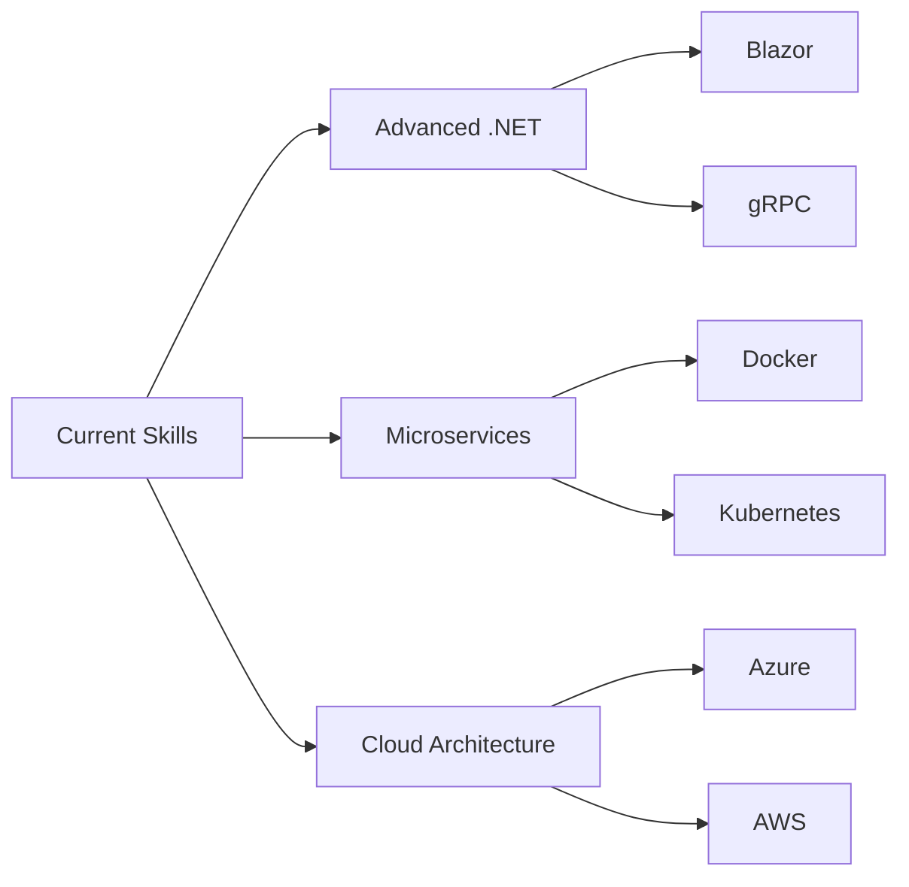

<div align="center">

<!-- Animated Header -->


<!-- Typing Animation -->
<a href="https://git.io/typing-svg"></a>

<!-- Animated Coding GIF -->


<!-- Badges Row -->
<p>
  
  
  
</p>

</div>

---

## 🚀 About Me

```csharp
namespace Developer.Profile
{
    public class MohamedMohyeldin : BackendDeveloper
    {
        public string Role => "Junior Backend Developer (.NET)";
        public string University => "Fayoum University";
        public string Degree => "Bachelor of Computer Science (2022-2026)";
        
        public List<string> Expertise => new()
        {
            "Clean Architecture & SOLID Principles",
            "CQRS with MediatR",
            "Domain-Driven Design",
            "RESTful API Development",
            "Entity Framework Core",
            "Unit Testing with xUnit"
        };
        
        public Dictionary<string, int> CodeStats => new()
        {
            { "Unit Tests Written", 20 },
            { "Production APIs Built", 2 },
            { "Years of OOP", 3 },
            { "Cups of Coffee", int.MaxValue }
        };
        
        public string Motto => "Writing clean, maintainable, and testable code";
        public bool OpenToOpportunities => true; // Seeking internships!
    }
}
```

<div align="center">

</div>

---

## 💼 Featured Projects

<table>
<tr>
<td width="50%" valign="top">

### 🏪 E-Commerce Web API
**Enterprise-Grade RESTful API**


**Tech Stack:**
- ASP.NET Core Web API
- Entity Framework Core
- Identity & JWT Authentication
- MediatR (CQRS Pattern)

**Architecture & Patterns:**
- ✅ Clean Architecture
- ✅ CQRS (Command Query Responsibility Segregation)
- ✅ Repository Pattern & Unit of Work
- ✅ Domain-Driven Design principles
- ✅ ULID for optimized keys

**Features:**
- 🔐 Complete authentication system
- 🛒 Shopping cart & wishlist
- 📦 Product management
- 📋 Order processing
- 🎯 EF Core configurations

</td>
<td width="50%" valign="top">

### 📈 Stock Trading MVC
**Production-Ready MVC Application**


**Tech Stack:**
- ASP.NET Core MVC
- Finnhub API Integration
- xUnit Testing Framework
- HttpClient Factory

**Key Achievements:**
- ✅ Multi-layered architecture
- ✅ 20+ comprehensive unit tests
- ✅ Real-time stock data integration
- ✅ Custom validation attributes
- ✅ Async/await best practices
- ✅ Dependency Injection throughout

**Architecture:**
- 🎯 Separation of concerns (Entities, Services, Contracts)
- 🎯 DTO pattern for data transfer
- 🎯 Service abstractions
- 🎯 Exception handling strategies

</td>
</tr>
</table>

<div align="center">

</div>

---

## 🛠️ Technical Arsenal

<div align="center">

### 💻 Languages & Core Skills


### 🏗️ Backend Development


### 🗄️ Databases


### 🧪 Testing & Tools


### 📊 Data & Analytics


</div>

---

## 🎯 Core Competencies

<table>
<tr>
<td width="33%" align="center">

### 🏛️ Architecture
- Clean Architecture
- CQRS Pattern
- Domain-Driven Design
- Dependency Injection
- Repository Pattern
- Unit of Work

</td>
<td width="33%" align="center">

### 💡 Best Practices
- SOLID Principles
- Design Patterns
- DTO Pattern
- Async/Await
- Exception Handling
- Code Testability

</td>
<td width="33%" align="center">

### 🔧 Development
- RESTful APIs
- Identity & JWT
- LINQ Queries
- OOP Principles
- Data Structures
- Algorithm Design

</td>
</tr>
</table>

---

## 📊 GitHub Analytics

<div align="center">
  
  
</div>

<div align="center">
  
</div>

<div align="center">
  
</div>

---

## 🎓 Education & Coursework

<div align="center">

| 🏫 Institution | 📚 Program | 📅 Duration | 🎯 Focus |
|:---------------|:-----------|:------------|:---------|
| **Fayoum University** | Bachelor of Computer Science | 2022 - 2026 | Backend Development |
| **FCAI** | Computers & AI | In Progress | Software Engineering |

### 📖 Relevant Coursework
`Object-Oriented Programming` • `Database Systems` • `Data Structures & Algorithms` • `Software Engineering`

</div>

---

## 🌱 Currently Expanding

<div align="center">



</div>

**🎯 Learning Path:**
- 🔹 Advanced ASP.NET Core features
- 🔹 Microservices architecture
- 🔹 Docker & containerization
- 🔹 Cloud platforms (Azure/AWS)
- 🔹 Message queues (RabbitMQ)
- 🔹 Redis caching strategies
- 🔹 CI/CD pipelines

---

## 📫 Let's Connect & Collaborate!

<div align="center">

[](mailto:mm5993@fayoum.edu.eg)
[](https://www.linkedin.com/in/mohamed-mohyeldin-amr-hassan-4010b92b3)
[](https://github.com/MohamedMohyEldein)
[](tel:+201550417027)

### 💼 Open to Internship Opportunities!
*Looking for opportunities to contribute to production systems and learn from experienced teams*

</div>

<div align="center">
  
</div>

---

<div align="center">

### 💭 Developer Wisdom


</div>

---

<div align="center">

### 🐍 Contribution Snake


</div>

---

<div align="center">

### 📈 Contribution Activity


</div>

---


<div align="center">
  
### ⚡ *"First, solve the problem. Then, write the code."* – John Johnson ⚡

**Made with 💙 for Clean Code, ☕ Coffee, and 🎯 SOLID Principles**

[](https://github.com/MohamedMohyEldein)

</div>
