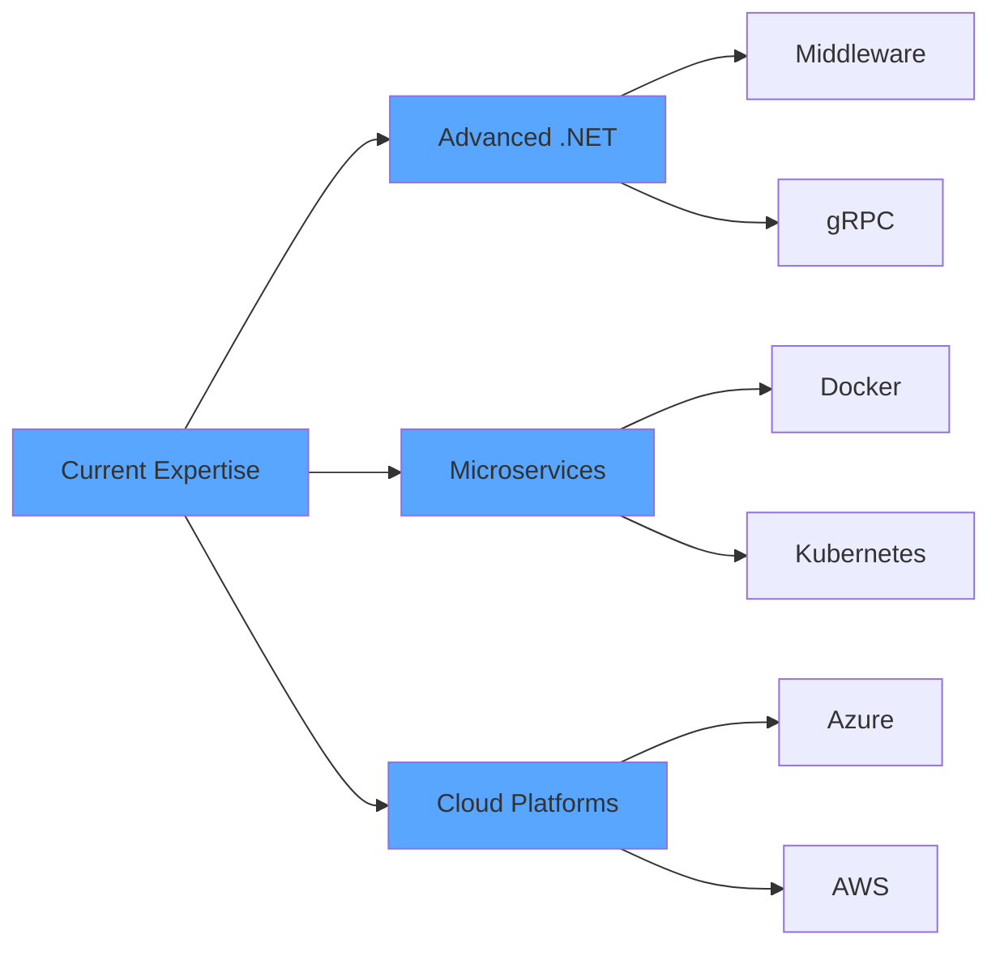

<!-- Animated Header -->

<!-- Typing Animation -->

<!-- Animated Developer GIF -->

<!-- Badges Row -->

  
  
  
  

---

## 👨‍💻 About Me

I'm **Mohamed Mohyeldin**, a Computer Science student at **Fayoum University** and a passionate **Junior Backend Developer** specializing in **.NET technologies**. I focus on building **clean, scalable, and maintainable backend systems** following industry best practices.

### 🎯 What I Do Best
- 🏗️ **Backend Development** - Building production-ready ASP.NET Core applications
- 🧩 **Clean Architecture** - Implementing SOLID principles and design patterns
- 📊 **Database Design** - Optimizing SQL queries and designing efficient schemas
- 🔌 **RESTful APIs** - Creating scalable and well-documented web services
- 🧪 **Quality Code** - Writing testable and maintainable code with comprehensive unit tests

### 🌱 Currently Learning
- Advanced ASP.NET Core features & middleware
- Microservices architecture patterns
- Cloud platforms (Azure/AWS)
- Docker & containerization
- Message queuing systems (RabbitMQ)
- Redis caching strategies

### 💼 Career Goals
I'm actively seeking **internship opportunities** where I can contribute to real-world production systems, collaborate with experienced developers, and continue growing my expertise in backend development.

---

## 🛠️ Technical Arsenal

### 💻 Languages & Core Skills

### 🏗️ Backend Frameworks & Tools

### 🗄️ Databases

### 🧪 Testing & Development Tools

### 📊 Data & Analytics

---

## 🎯 Core Competencies

<table>
<tr>
<td width="33%" align="center">

### 🏛️ Architecture & Patterns
- Clean Architecture
- CQRS Pattern
- Domain-Driven Design
- Repository Pattern
- Unit of Work
- Dependency Injection

</td>
<td width="33%" align="center">

### 💡 Best Practices
- SOLID Principles
- Design Patterns
- DTO Pattern
- Async/Await
- Exception Handling
- Code Testability

</td>
<td width="33%" align="center">

### 🔧 Development Skills
- RESTful APIs
- Identity & JWT
- LINQ Queries
- OOP Principles
- Data Structures
- Algorithm Design

</td>
</tr>
</table>

---

## 📊 GitHub Analytics

  
  

  

  

---

## 🎓 Education & Coursework

| 🏫 Institution | 📚 Program | 📅 Duration | 🎯 Faculty |
|:---------------|:-----------|:------------|:-----------|
| **Fayoum University** | Bachelor of Computer Science | 2022 - 2026 | Computers & Artificial Intelligence |

### 📖 Relevant Coursework
`Object-Oriented Programming` • `Database Systems` • `Data Structures & Algorithms` • `Software Engineering`

---

## 🌱 Learning Roadmap

**🚀 Focus Areas:**
- 🔹 Advanced ASP.NET Core features
- 🔹 Microservices architecture
- 🔹 Docker & containerization
- 🔹 Cloud platforms (Azure/AWS)
- 🔹 Message queues (RabbitMQ)
- 🔹 Redis caching strategies
- 🔹 CI/CD pipelines

---

## 🐍 Contribution Activity

---

## 📈 Activity Graph

---

## 📬 Let's Connect & Collaborate!

### 💼 Open to Internship Opportunities!

 

*Looking for opportunities to contribute to production systems and learn from experienced teams*

 

**Made with 💙 for Clean Code • ☕ Coffee • 🎯 SOLID Principles**

 

