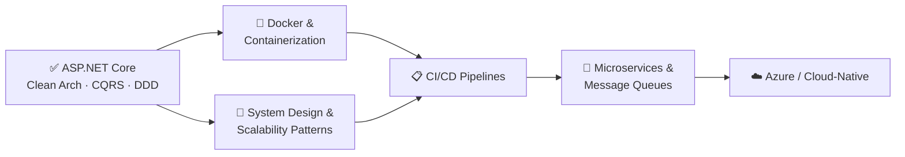

  

---

## 👨‍💻 About Me

Junior Backend Developer specializing in **.NET / ASP.NET Core**, with real-world experience building production-grade systems from the ground up. Currently a final-year CS student at Fayoum University (graduating June 2026), working on two live projects — a property booking platform and an e-commerce API — with full Clean Architecture, CQRS, DDD, and payment gateway integrations.

- 🏗️ Strong foundation in **Clean Architecture, CQRS, DDD, and SOLID principles**
- 💳 Hands-on experience with **Paymob payment gateway** — webhooks, refund flows, concurrency-safe transactions
- 🔐 Built complete **JWT auth systems** — refresh token rotation, RBAC, email verification
- 🧪 Writes testable code — **xUnit unit & integration tests**, MediatR pipeline behaviors
- 📍 Based in Giza, Egypt — available for on-site or remote opportunities

---

## 🛠️ Tech Stack

**Languages**

**Frameworks & Libraries**

**Architecture & Patterns**

**Databases & Infrastructure**

**Developer Tools**

---

## 🚀 Featured Projects

### 🏠 [Sakenni](https://github.com/MohamedMohyEldein) — Property Booking Platform
> **ASP.NET Core · EF Core · SQL Server · Clean Architecture · CQRS · DDD** `2025 – Present`

A full-featured, production-grade property booking platform built with enterprise-level architecture.

| Area | What Was Built |
|------|---------------|
| **Architecture** | Clean Architecture across 4+ projects; DDD domain layer with entities, domain events, and Result pattern |
| **CQRS** | 15+ command/query handlers routed through MediatR; generic `Result<T>` for error-free API responses |
| **Authentication** | JWT access tokens, refresh token rotation, RBAC, email verification, HTML-templated password reset |
| **Payments** | Full Paymob integration — webhooks, booking confirmation, `TransactionScope` with Serializable isolation for concurrency-safe refunds |
| **Modules** | Property management (filtering & pagination), reservation engine, ratings & reviews, user favorites, Cloudinary image uploads |
| **Infrastructure** | Hangfire background jobs, centralized error handling middleware, Ardalis Specification pattern, MediatR pipeline behaviors |

---

### 🛒 [ShopCore](https://github.com/MohamedMohyEldein) — E-Commerce Web API
> **ASP.NET Core · EF Core · SQL Server · ASP.NET Identity** `2024`

Enterprise-grade e-commerce API with full separation across Domain, Application, Infrastructure, and Presentation layers.

- CQRS with MediatR; full cart, wishlist, orders, and products modules following DDD principles
- ASP.NET Identity + JWT authentication; Repository Pattern + Unit of Work with ULID keys
- Advanced EF Core mappings — owned entities, value conversions, reusable query specifications

---

### 📈 [StockTrader](https://github.com/MohamedMohyEldein) — MVC Stock Tracking App
> **ASP.NET Core MVC · xUnit · Finnhub API** `2025`

- Clean Architecture MVC app integrating Finnhub real-time stock API via HttpClient Factory
- **20+ xUnit unit tests** covering business logic, edge cases, and async methods with full service layer coverage
- Custom validation attributes, async/await throughout, structured exception handling

---

## 📊 GitHub Stats

---

## 🎓 Education

**Bachelor of Science in Computer Science** — Fayoum University, Egypt `2022 – June 2026`

*Relevant coursework: Object-Oriented Programming · Database Systems · Data Structures & Algorithms · Software Engineering*

---

## 🗺️ What I'm Working Towards

```mermaid
graph LR
    A[✅ ASP.NET Core\nClean Arch · CQRS · DDD] --> B[🔄 Docker &\nContainerization]
    A --> C[🔄 System Design &\nScalability Patterns]
    B --> D[📋 CI/CD Pipelines]
    C --> D
    D --> E[🎯 Microservices &\nMessage Queues]
    E --> F[☁️ Azure / Cloud-Native]
```

Currently exploring: **Docker · CI/CD · Redis · System Design**

---

**💼 Open to Junior Backend Developer roles — on-site in Cairo/Giza or remote**

