<div align="center">
  
</div>


<div align="center">
  
</div>

---

## 🚀 About Me

<table>
<tr>
<td width="60%">

### 👨‍💻 Mohamed Mohyeldin Amr Ahmed Hassan

**Junior Backend Developer specializing in .NET**

📍 **Based in:** Giza, Egypt

🎯 **Core Expertise:**
- Clean Architecture & SOLID Principles
- RESTful API Design & Development
- Entity Framework Core & Database Design
- CQRS Pattern with MediatR
- Unit Testing & TDD

💡 **Mission:**  
Building scalable, testable backend systems with clean, maintainable code that solve real-world problems.

</td>
<td width="40%">
<div align="center">
  
</div>
</td>
</tr>
</table>

<div align="center">
  
[](mailto:mm5993@fayoum.edu.eg)
[](https://www.linkedin.com/in/mohamed-mohyeldin-amr-hassan-4010b92b3/)
[](https://github.com/MohamedMohyEldein)
[](tel:+2015504170)

</div>

---

## 💻 Tech Stack

<div align="center">

### Core Technologies


### Backend & Databases


### Architecture & Patterns


### Testing & Tools


### Additional Skills


</div>

---

## 🎯 Core Competencies

<div align="center">
  
</div>

```plaintext
┌─────────────────────────────────────────────────────────────┐
│  ✨ Backend Development                                     │
│  • RESTful API Design & Implementation                      │
│  • Clean Architecture & SOLID Principles                    │
│  • CQRS with MediatR                                        │
│  • JWT Authentication & Identity Management                 │
│                                                              │
│  🗄️ Database & ORM                                          │
│  • Entity Framework Core Configurations                     │
│  • Repository Pattern & Unit of Work                        │
│  • SQL Optimization & Database Design                       │
│                                                              │
│  🧪 Quality Assurance                                       │
│  • Unit Testing with xUnit (20+ test cases)                │
│  • Test-Driven Development (TDD)                            │
│  • Edge Case & Async Testing                                │
│                                                              │
│  🏗️ Software Design                                         │
│  • Dependency Injection & IoC Containers                    │
│  • DTO Pattern & Service Abstractions                       │
│  • Design Patterns (Repository, Factory, Strategy)          │
└─────────────────────────────────────────────────────────────┘
```

---

## 📊 GitHub Stats

<div align="center">
  


</div>

---

## 🎓 Education

<div align="center">

| 🏛️ Institution | 📚 Degree | 📅 Period |
|:---:|:---:|:---:|
| **Fayoum University** | Bachelor of Computer Science | 2022 - 2026 |

**Relevant Coursework:** Object-Oriented Programming • Database Systems • Algorithms • Data Structures

</div>

---

## 🗺️ Learning Roadmap

```mermaid
graph LR
    A[✅ ASP.NET Core] --> B[🔄 Microservices]
    A --> C[🔄 Docker & Kubernetes]
    B --> D[📋 Message Queues]
    C --> D
    D --> E[🎯 Cloud Architecture]
    A --> F[🔄 Advanced EF Core]
    F --> G[📋 Performance Optimization]
```

<div align="center">
  
</div>




### Future Goals
- 🐳 **Docker & Containerization** - Building containerized .NET applications
- 🏗️ **Microservices Architecture** - Distributed systems design
- ☁️ **Azure Cloud Services** - Cloud-native development
- 📨 **RabbitMQ/MassTransit** - Message-driven architecture
- 🔍 **Advanced EF Core** - Performance tuning and optimization
- ⚡ gRPC & High-Performance APIs
- 🔐 Advanced Security Patterns
- 📊 Distributed Caching (Redis)
- 🎯 System Design & Scalability

---

## 🏆 Highlights

<div align="center">

```plaintext
🎯 20+ Unit Tests Written         ⚡ Clean Architecture Expert
🏗️ CQRS Implementation            🔐 JWT Authentication
📦 Repository Pattern              🌐 RESTful API Design
🧪 TDD Practitioner               📊 Database Optimization
```

</div>

---

## 📫 Let's Connect!

<div align="center">
  
  
  <br><br>
  
  **💼 Open to Backend Developer opportunities and collaborations!**
  
  <br>
  
  <table>
    <tr>
      <td align="center" width="33%">
        <br>
        <a href="https://www.linkedin.com/in/mohamed-mohyeldin-amr-hassan-4010b92b3/">
          
        </a>
      </td>
      <td align="center" width="33%">
        <br>
        <a href="https://github.com/MohamedMohyEldein">
          
        </a>
      </td>
      <td align="center" width="33%">
        <br>
        <a href="tel:+2015504170">
          
        </a>
      </td>
    </tr>
  </table>
  
  [](mailto:mm5993@fayoum.edu.eg)
  
</div>

---

<div align="center">
  
</div>
